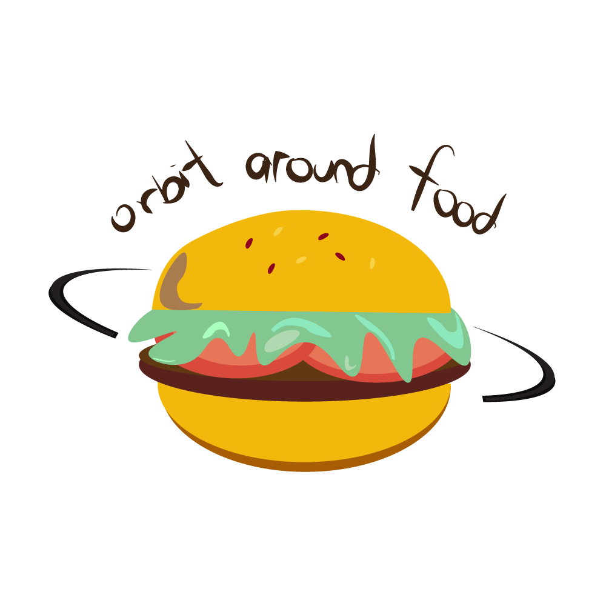

# OrbitAroundFood 
NUS CP2106 Independent Software Development Project (Orbital)  

## Team members
- [Chen Xihao](https://github.com/howtoosee/)
- [Lau Xin Yee](https://github.com/xinyee20)

## Some information on our project
- [Introduction video](https://youtu.be/VJ70QqI0nWs)
- [Poster](https://i.postimg.cc/7YrsZrKh/Orbit-Around-Food.png)

#### Aim
We aim to develop an application which collates all the food options in NUS (Currently limited to UTown due to Covid'19). The project will allow users to make a more informed decision on our food choices. The application will be very useful for incoming freshmen who wish to explore the campus and discover their favourite stores without much hassle.

#### Possible Extensions
- Allow the sharing of restaurants and food choice between users within the app
- Personalise daily recommendations based on the users’ dining history and search history using Machine Learning 
- Advertisements to promote stalls and restaurants

#### Product
- iOS App
- Android App

#### Tech Stack
- ReactNative for app development
- Metro for ReactNative
- JavaScript, JSX, Python
- FireBase for backend database and authentication